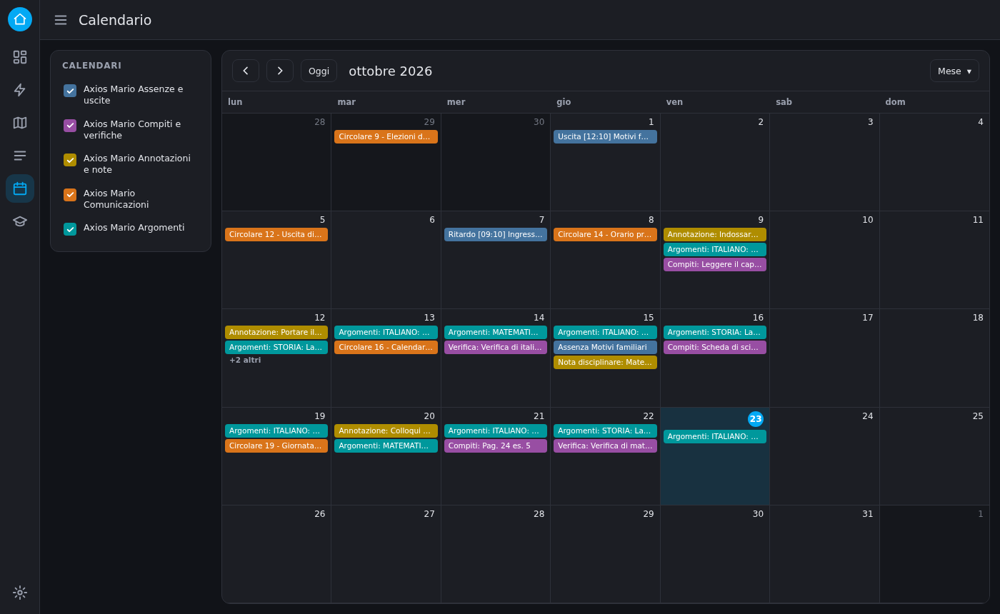
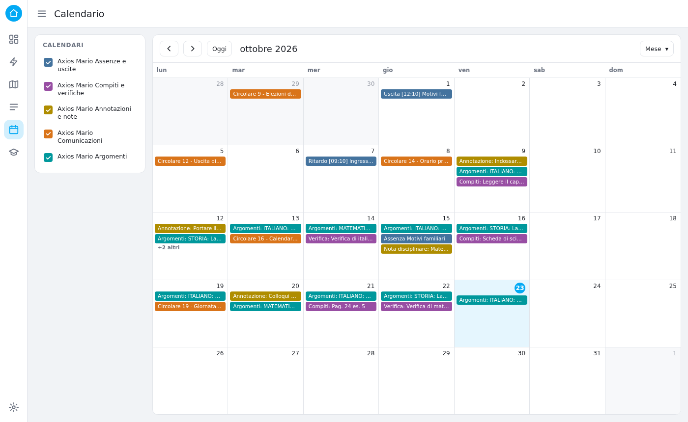

# Entità

[← Torna al README](../README.md)

Per ogni studente l'integrazione crea un dispositivo, `Axios <nome>`, con queste entità. Gli ID hanno la forma `<dominio>.axios_<nome_studente>_<chiave>`: con uno studente chiamato "Mario" si ottiene, per esempio, `sensor.axios_mario_absences`.

Le chiavi degli ID sono sempre in inglese e non cambiano con la lingua. I **nomi visibili** in interfaccia seguono invece la lingua di Home Assistant (italiano o inglese).

## Sensori

| Chiave (suffisso) | Valore | Attributi principali |
|---|---|---|
| `communications` | Totale delle comunicazioni | `non_lette`, `ultima`, `elenco` (le ultime N, vedi [opzioni](configurazione.md#opzioni)) |
| `communications_unread` | Comunicazioni non lette | – |
| `absences` | Assenze totali | `ultimo_evento`, `eventi` |
| `late_entries` | Ritardi totali | – |
| `early_exits` | Uscite anticipate totali | – |
| `absence_percentage` | Percentuale di assenze (%) | – |
| `homework` | Giorni con compiti o verifiche | `giorni_considerati`, `elenco` |
| `annotations` | Giorni con annotazioni | `elenco` |
| `disciplinary_notes` | Giorni con note disciplinari | `elenco` |
| `last_topics` | Data dell'ultimo giorno con argomenti | `argomenti`, `data_iso` |
| `last_update` | Data e ora dell'ultima lettura | – |

Note:

- **Finestra dei giorni.** Compiti, annotazioni, note disciplinari e argomenti si riferiscono agli ultimi giorni del registro di classe (14 di default, vedi [opzioni](configurazione.md#opzioni)), non a tutto l'anno scolastico. Le assenze coprono invece tutto il periodo restituito dal portale.
- **Argomenti.** Gli elenchi dei sensori non contengono gli argomenti svolti: sono testi lunghi e farebbero superare il limite di dimensione degli attributi salvati da Home Assistant. Si leggono nel calendario *Argomenti*, nel sensore `last_topics` e nel [pannello](pannello.md).
- **`last_topics`** mostra l'ultimo giorno che ha argomenti, che non coincide per forza con oggi: nei weekend e nei giorni festivi non ce ne sono. Lo stato è la data come la scrive il portale, gli argomenti sono nell'attributo `argomenti`.

## Calendari

Le voci compaiono come eventi di un'intera giornata.

| Entità | Contenuto | Giorno dell'evento |
|---|---|---|
| `calendar.axios_<nome>_absences` | Assenze, ritardi e uscite anticipate | Data della voce in Assenze |
| `calendar.axios_<nome>_homework` | Compiti e verifiche | Giorno della riga di registro |
| `calendar.axios_<nome>_annotations` | Annotazioni e note disciplinari | Giorno della riga di registro |
| `calendar.axios_<nome>_communications` | Comunicazioni (le ultime N) | Data di pubblicazione |
| `calendar.axios_<nome>_topics` | Argomenti svolti | Giorno della riga di registro |

- I compiti compaiono nel giorno della riga di registro in cui sono inseriti, **non** nella data di consegna.
- Nel calendario *Argomenti* il titolo mostra l'inizio del testo e la descrizione dell'evento contiene tutti gli argomenti del giorno. I giorni senza argomenti non hanno eventi.
- Nel calendario *Comunicazioni* la descrizione riporta tipo, autore e titolo.

### Come appaiono nella pagina Calendario

Ogni calendario compare nella pagina **Calendario** di Home Assistant con il nome del dispositivo seguito dal nome del calendario, per esempio *Axios Mario Compiti e verifiche*. Le caselle nell'elenco a sinistra mostrano o nascondono i singoli calendari.



<details>
<summary>Tema chiaro</summary>



</details>

<sub>Illustrazione della pagina Calendario con dati di esempio. L'aspetto reale, compresi i colori assegnati a ogni calendario, dipende dalla versione di Home Assistant e dal tema che usi.</sub>

Il titolo di ogni evento dipende dal calendario:

| Calendario | Titolo dell'evento |
|---|---|
| Assenze e uscite | La descrizione della voce, per esempio `Uscita [12:10] Motivi familiari` |
| Compiti e verifiche | `Compiti: ...` oppure `Verifica: ...` |
| Annotazioni e note | `Annotazione: ...` oppure `Nota disciplinare: ...` |
| Comunicazioni | Il titolo della comunicazione |
| Argomenti | `Argomenti: ...`, con l'inizio del testo |

Nella vista mensile i titoli lunghi vengono troncati: aprendo l'evento si legge il testo completo nella descrizione. Nell'esempio le voci di compiti, annotazioni e argomenti sono presenti solo per gli ultimi 14 giorni, perché è la finestra di registro predefinita (vedi [opzioni](configurazione.md#opzioni)); assenze e comunicazioni risalgono più indietro.

## Evento delle novità

| Entità | Contenuto |
|---|---|
| `event.axios_<nome>_news` | Scatta a ogni novità. Vedi [Notifiche e automazioni](notifiche.md). |

## Esempio: una scheda con i dati

Per mostrare un valore in una scheda della dashboard di Home Assistant puoi usare normalmente le entità, per esempio:

```yaml
type: entities
title: Scuola di Mario
entities:
  - sensor.axios_mario_communications_unread
  - sensor.axios_mario_absences
  - sensor.axios_mario_homework
  - sensor.axios_mario_last_update
```

Per leggere un attributo in un template:

```
{{ state_attr('sensor.axios_mario_communications', 'ultima') }}
```
