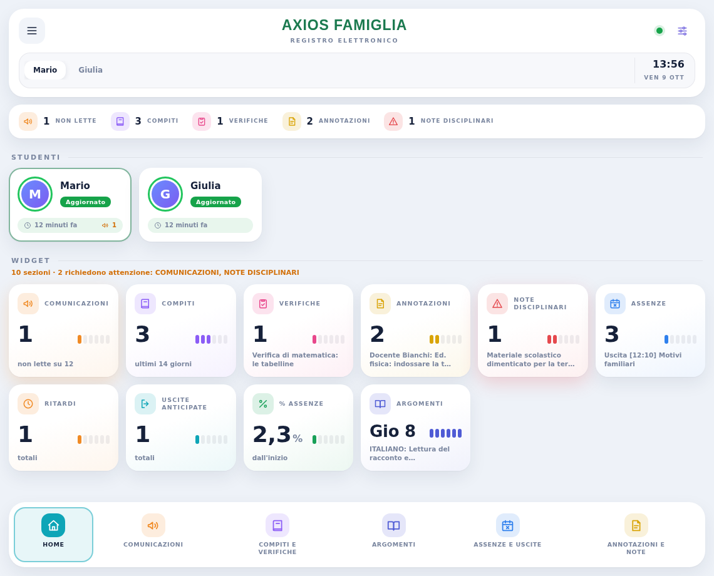
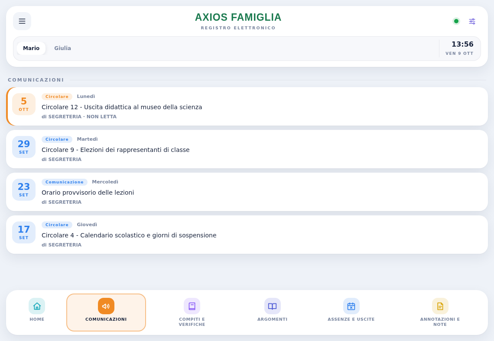
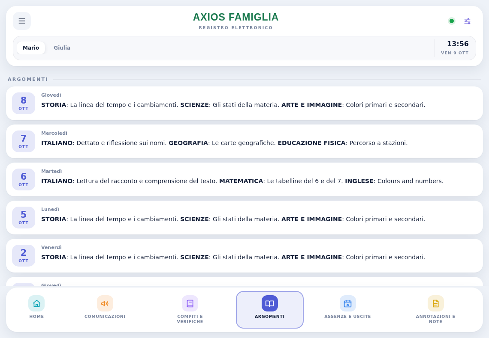
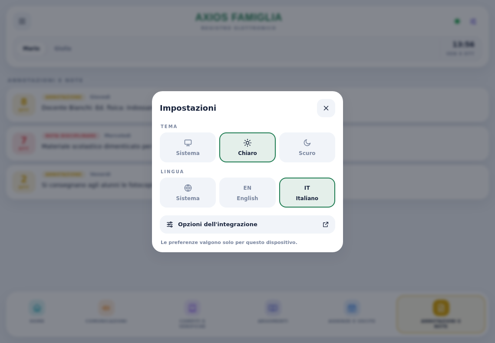
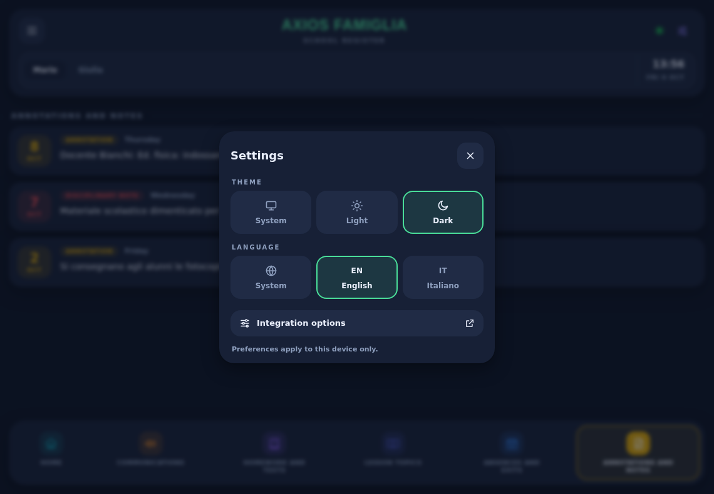
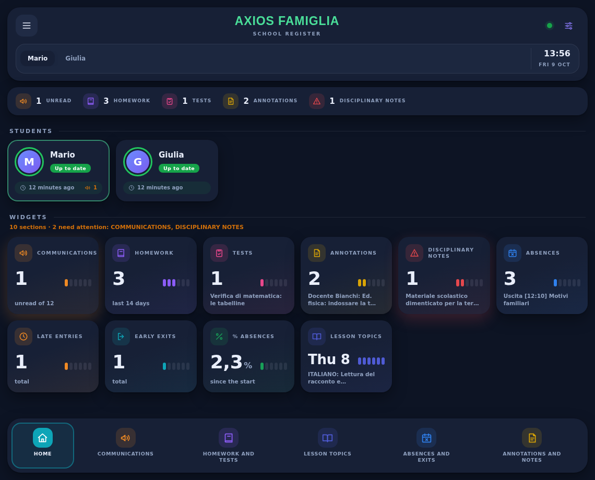
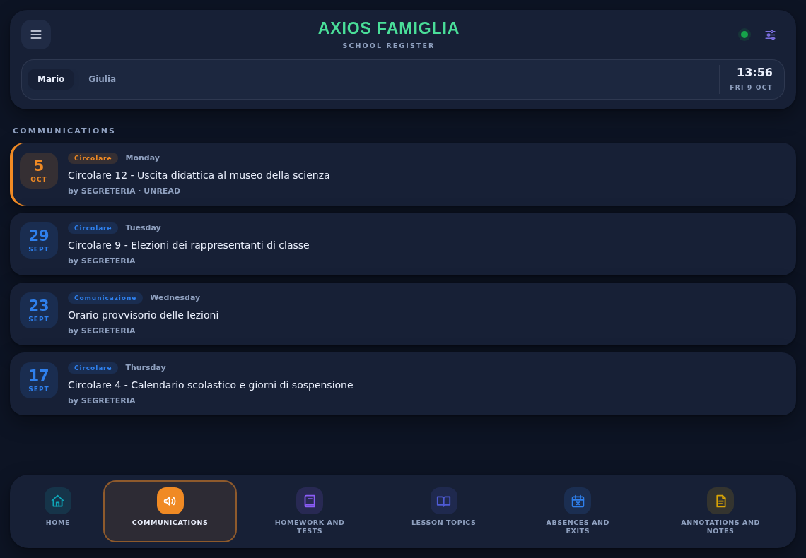
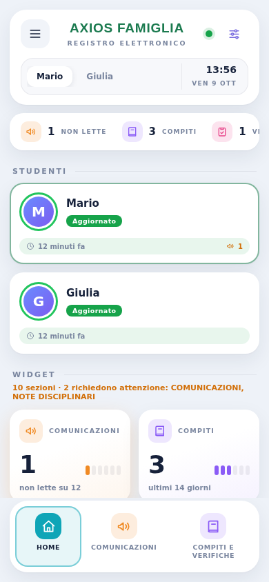

# Il pannello

[← Torna al README](../README.md)

Dopo l'installazione compare la voce **Axios Famiglia** nella barra laterale di Home Assistant. Non serve nessuna configurazione né nessun file YAML: il pannello si costruisce da solo a partire dalle entità dell'integrazione.

## La Home

### L'intestazione

- **Menu** (in alto a sinistra): apre e chiude la barra laterale di Home Assistant.
- **Pallino di stato** (in alto a destra), con tre colori:

| Colore | Significato |
|---|---|
| Verde | Dati aggiornati. |
| Arancione | L'ultima lettura risale a più di 6 ore fa. |
| Rosso | Una o più entità principali (comunicazioni, assenze, compiti, ultimo aggiornamento) non sono disponibili. |

- **Impostazioni** (icona a cursori): tema e lingua, vedi [più sotto](#impostazioni-del-pannello).
- **Selettore degli studenti** e **orologio**.

### La barra dei riepiloghi

Sotto l'intestazione compaiono solo i numeri diversi da zero tra: comunicazioni non lette, compiti, verifiche, annotazioni e note disciplinari. Se non c'è nulla da segnalare, la barra mostra "tutto in ordine".

### Gli studenti

Un riquadro per ogni studente, con l'iniziale, lo stato (**Aggiornato**, **Non aggiornato**, **Non disponibile**), da quanto tempo sono stati letti i dati e, se ce ne sono, il numero di comunicazioni non lette. Toccando un riquadro si passa a quello studente.

### I widget

Ogni widget mostra un numero, una barretta a segmenti e una didascalia. Toccandolo si apre la sezione corrispondente.

| Widget | Numero | Didascalia | Apre |
|---|---|---|---|
| **Comunicazioni** | non lette | "non lette su N" oppure "tutte lette" | Comunicazioni |
| **Compiti** | giorni con compiti | "ultimi N giorni" | Compiti e verifiche |
| **Verifiche** | giorni con verifiche | la verifica più recente | Compiti e verifiche |
| **Annotazioni** | giorni con annotazioni | l'annotazione più recente | Annotazioni e note |
| **Note disciplinari** | giorni con note | la nota più recente | Annotazioni e note |
| **Assenze** | assenze totali | l'ultima voce in Assenze | Assenze e uscite |
| **Ritardi** | ritardi totali | – | Assenze e uscite |
| **Uscite anticipate** | uscite totali | – | Assenze e uscite |
| **% assenze** | percentuale | – | Assenze e uscite |
| **Argomenti** | giorno dell'ultima lezione con argomenti | l'inizio degli argomenti | Argomenti |

Sotto il titolo "Widget" una riga riassume quanti widget **richiedono attenzione**. Lo sono, ed escono evidenziati con un alone colorato, le **comunicazioni non lette** e le **note disciplinari**.

## La barra in basso

È sempre visibile in fondo alla pagina, qualunque sia la quantità di contenuto, e ogni voce ha un colore. La voce attiva è evidenziata. Il titolo di ogni pagina è **identico** al nome della voce nella barra.

| Voce (italiano) | Voce (inglese) | Contenuto |
|---|---|---|
| Home | Home | Riepilogo e widget |
| Comunicazioni | Communications | Circolari e comunicazioni della scuola |
| Compiti e verifiche | Homework and tests | Compiti e verifiche del registro |
| Argomenti | Lesson topics | Argomenti svolti a lezione |
| Assenze e uscite | Absences and exits | Assenze, ritardi e uscite anticipate |
| Annotazioni e note | Annotations and notes | Annotazioni dei docenti e note disciplinari |

### Come si leggono le liste

Ogni voce ha un riquadro con il **giorno e il mese**, un'**etichetta** del tipo (per esempio "Circolare", "Compiti", "Uscita"), il **giorno della settimana** e il testo. Le voci sono ordinate dalla più recente.

- Le **comunicazioni non lette** hanno un bordo colorato a sinistra e la scritta "NON LETTA".
- Le assenze non conteggiate dal portale riportano "non conteggiata".
- Negli **argomenti** i nomi delle materie sono in grassetto.

## Impostazioni del pannello

L'icona a cursori in alto a destra apre le impostazioni.

| Impostazione | Valori |
|---|---|
| **Tema** | Sistema, Chiaro, Scuro |
| **Lingua** | Sistema, English, Italiano |

- Con **Sistema** il tema segue quello chiaro o scuro di Home Assistant, e la lingua segue quella del tuo profilo.
- Le preferenze valgono **solo per il dispositivo e il browser** in cui le imposti e non cambiano il profilo di Home Assistant. Su telefono e computer vanno scelte separatamente.
- Gli **amministratori** trovano nel menu anche il collegamento alle [opzioni dell'integrazione](configurazione.md#opzioni).
- Il menu si chiude con la X, toccando fuori oppure con il tasto Esc.

<table>
  <tr>
    <td></td>
    <td></td>
  </tr>
</table>

## Tema scuro

## Da telefono

Su schermi stretti il pannello si adatta: i widget passano su due colonne, i riquadri degli studenti si allargano a tutta la riga e le impostazioni si aprono dal basso. La barra in basso scorre in orizzontale se le voci non entrano tutte.

## Chi può vedere il pannello

Per impostazione predefinita il pannello è visibile a **tutti gli utenti** di Home Assistant. Contiene dati scolastici di un minore: se vuoi limitarlo agli amministratori:

1. Apri il file `custom_components/axios_famiglia/panel.py`.
2. Imposta `PANEL_REQUIRE_ADMIN = True`.
3. Riavvia Home Assistant.

Se aggiorni l'integrazione, la modifica va rifatta, perché il file viene sostituito.

## Da dove arrivano i dati

Il pannello **non ha un proprio accesso al portale** e non scrive nulla: legge soltanto le [entità](entita.md) dell'integrazione, che hanno il prefisso `axios_<nome>_`.

- Le liste di comunicazioni, compiti, annotazioni, note e assenze arrivano dagli attributi dei sensori, quindi mostrano solo ciò che l'integrazione legge: l'ultima finestra di giorni di registro e le ultime N comunicazioni scelte nelle [opzioni](configurazione.md#opzioni).
- Gli **argomenti** arrivano dal calendario *Argomenti*. Se il calendario non risponde, il pannello ripiega sul sensore *Ultimi argomenti* e mostra solo l'ultimo giorno.
- L'elenco degli studenti viene chiesto all'integrazione. Se la richiesta non riesce, il pannello lo ricava dai nomi delle entità.

## Limiti

- Il pannello cerca le entità dal loro ID standard (`sensor.axios_<nome>_...`). Se rinomini un'entità, quel dato non compare più nel pannello.
- Tema e lingua non si sincronizzano tra dispositivi diversi.
- Il pannello mostra le informazioni, ma non permette di segnare una comunicazione come letta o di inviare nulla al portale.
